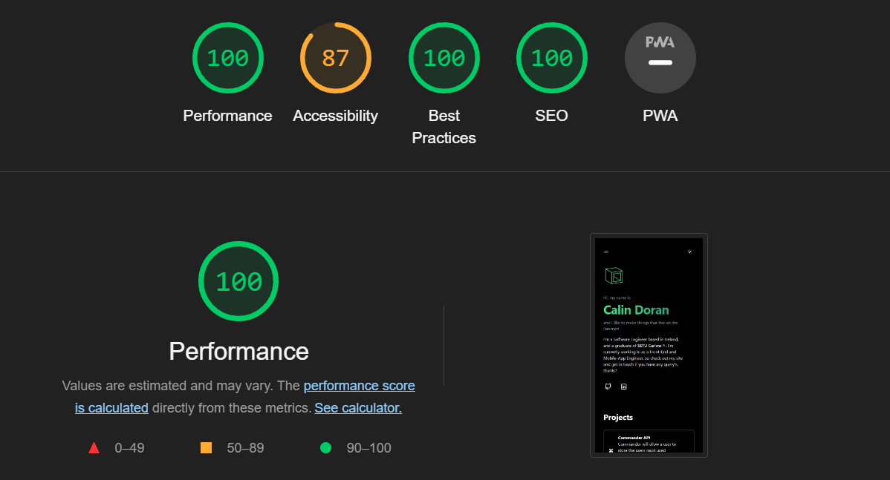

<p align="center">
    
</p>

<br />

## 🌍 Features

- Framework: [Next.js](https://nextjs.org/)
- Styling: [Tailwind CSS](https://tailwindcss.com/)
- Deployment: [GitHub Pages](https://pages.github.com/)
- Content: [Markdown](https://www.markdownguide.org/)
- Favicon: [Favicon Generator](https://realfavicongenerator.net/)

<br />

## 🚀 Running Locally

This application requires Node.js v20.x+ and is running Nextjs 14.x+.

```bash
git clone https://github.com/calindoran/calindoran.github.io
```

```bash
cd calindoran.github.io
```

```bash
npm install
```

We can lint using the built in linter from Nextjs.

```bash
npm run lint
```

```bash
npm run dev
```

<br />

Running a production build you will need to do the following.

Install the serve package globally.

```bash
npm i -g serve
```

Following.

```bash
npm run build
```

```bash
npm run serve out
```

You can then follow localhost or an IP generated at build time.

<br />

## 🍴 Cloning / Forking

Please review the [license](https://github.com/calindoran/calindoran.github.io/blob/main/LICENSE.txt). And remove any data that includes personal information pertaining to myself.

<br />

## 💡 Lighthouse

<div style="display: flex; justify-content: space-between;">
    <div>
        <p>Desktop result:</p>
        
    </div>
    <div>
        <p>Mobile result:</p>
        
    </div>
</div>

Last updated: 2023

<br />

<p align="center">Made in Ireland 🇮🇪</p>
